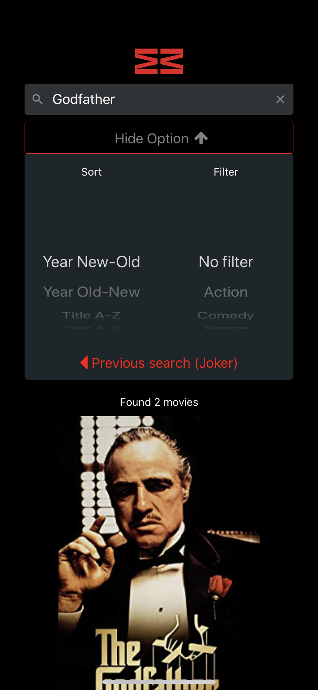
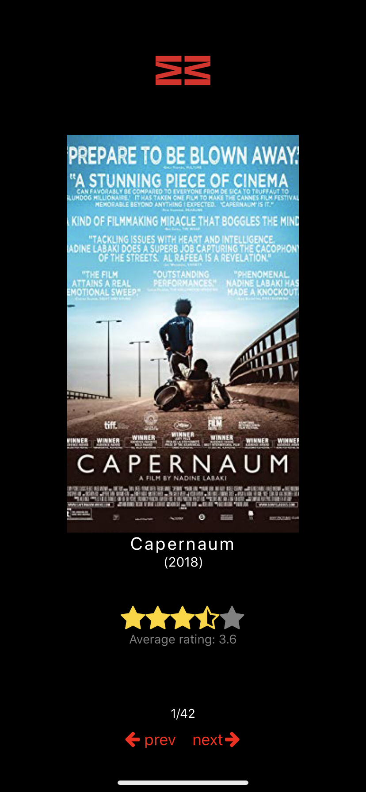
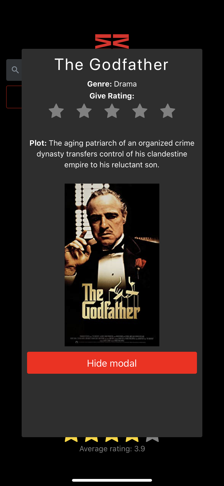

# Prosjekt 4 - App med React Native

## Funksjonalitet

Som oppgaven legger opp til så har vi basert oss på backend og frontend fra Prosjekt 3, hvor vi laget en søkemotor for 
film. Det aller meste har veldig lik funksjonalitet som det hadde der, hvor det for brukeren sin del er hovedsaklig det
kosmetiske som er største forskjellen. Avansert visning (BubbleChart som viser filmenes distribusjon over tiårene) er
det eneste som vi ikke har tatt videre i form av funksjonalitet. I stedet har vi, som oppgaven krever, implementert
persistent lagring på brukerens enhet av det forrige søket brukeren foretok seg.

##### Appens viktigste funksjoner:

* Søkefunksjon med mulighet for sortering på år eller tittel og filtrering på sjanger.
* Dynamisk lasting av data med sidehåndtering.
* Detaljert visning i form av en pop-up (modal) når man trykker på en poster.
* Mulighet for å gi stjernerangering av filmene (lagres i databasen).
* Knapp for å utføre forrige søk gjort på enheten (knappen vil bare vises hvis det faktisk foreligger et tidligere søk)

## Teknologi

Selv om appen i stor grad baserer seg på Prosjekt 3 og har gjenkjennelig komponentsstruktur, har vi gjort noen endringer
i selve logikken her og der, noe som vi mener har resultert i mindre og mer oversiktelig kode. Vi har for eksempel i
stor grad gått vekk fra React Redux til fordel for å bruke useState Hooks, da vi har fått intrykk av at det relativt nylig
innførte konseptet React Hooks er fremtiden for utvikling i React, og dermed ønsket å sette oss enda mer inn det enn vi
har gjort i de foregående prosjektene. Sidehåndtering er også forskjellig fra forrige gang siden vi ikke lenger har
mongoose inkludert i prosjektet, og dermed har vi laget egne metoder for å håndtere sidevisning i stedet for mongoose-paginate.

Generelt har vi tatt utgangspunkt i koden vår fra det forrige prosjektet, og gjennom utviklingsprosessen endret ting der
det har vært helt nødvendig og der vi mener det har vært hensiktsmessig.

#### React Native

Overgangen fra vanlig React til React Native er ikke et veldig langt hopp, noe man lett ser på oppbyggingen av komponenter
som er så godt som helt lik bortsett fra at man bruker egne innebygde tags i React Native i stedet for HTML tags. Den 
største forskjellen er vel egentlig at man gjør styling ved hjelp av et styles-objekt direkte i komponentene, i motsetning
til React hvor man helst baserer seg på en separat CSS-fil. Kort fortalt er JavaScript *enda* mer altomfattende enn det
allerde er i React.

**AsyncStorage** har vi brukt for å kunne gjenta det siste søket gjort på enheten uavhengig av om applikasjonen har blitt lukket.

#### Expo 

I utviklingen har vi brukt `expo-cli` både for å initiere prosjektet gjennom `expo init` og for å manuelt **brukerteste**
applikasjonen ende-til-ende på iOS og Android.

#### Tredjepartskomponenter

Siden de forskjellige bootstrap-komponentene vi brukte en del av i Prosjekt 3 ikke fungerer med React Native, har vi
måttet finne andre. Bortsett fra det som kommer innebygd i React Native-bibliteket, har vi benyttet oss av:

* ***React Native Elements*** har blitt brukt for å impolementere selve søkebaren samt knapper her og der. Biblioteket
sitt view kalt *Overlay* bruker vi for å lage pop-upen som viser mer detaljert info om den aktuelle filmen.
* ***React Native Star Rating*** for de klikkbare stjernene som gjør at man kan lagre sin rating i databasen vår.
* *FontAwesome* fra ***React Native Vector Icons*** bruker vi for å gjøre knappene våre litt kulere.
* ***Axios*** for å lagre brukerenes ratinger på riktig film i databasen.

#### Testing

Appen er testet manuelt på både Android og iOS ved hjelp av Expo klienten på hver av platformene. Alle funksjoner har blitt testet.
Søk, filtrering og sortering er testet gjennom å sammenligne resultat i appen, med resultat i db.
I tillegg er det sjekket at gitt rating blir lagt til i db, og at average rating blir oppdatert.
Styling har vi testet på flere mobiler.
Skjermstørrelsen på mobilen vil påvirke popup’en til filmene i noe grad(mindre mobilskjermer må bla i popup’en).
På android ser meny for options annerledes ut enn på ios.
Dette kommer av at komponenten (Picker) har forskjellig utseende på de to plattformene.
Ved en senere oppdatering av appen, kunne vi ha fikset menyen i android til å se ut som den på iOS. 

Søk og resultat:

Options meny med mulighet for å se forrige søk:

Side- valg og visning:

Popup, med info og mulighet for å gi rating:

---

### Fremgangsmåte for testing av prosjekt

Først naviger til ønsket lokasjon på din maskin, deretter:

`git clone git@gitlab.stud.idi.ntnu.no:IT2810-H19/teams/team-13/project-4.git` for SSH, eller:

`git clone https://gitlab.stud.idi.ntnu.no/IT2810-H19/teams/team-13/project-4.git` for HTTPS.

Navigér inn i prosjektmappen:

`cd prosjekt-4`

Installer dependencies:

`npm install`

Start Expo-serveren:

`npm start`

Deretter scanner du QR-koden i Expo-appen på din mobile enhet (evnt. skriver inn adressen manuelt).
